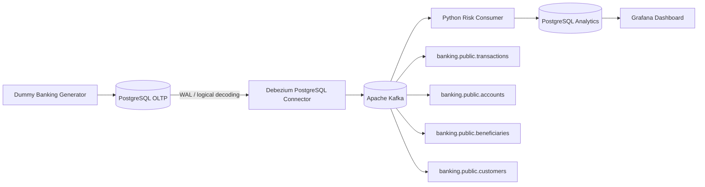

# Banking CDC — Near Real-Time Risk Monitoring

Portfolio Data Engineering sederhana untuk menunjukkan **log-based Change Data Capture (CDC)** dengan use case yang memang membutuhkan perubahan data secara incremental dan cepat.

Project ini mensimulasikan aplikasi core banking yang hanya menulis ke PostgreSQL OLTP. Perubahan row ditangkap dari PostgreSQL WAL oleh Debezium, diteruskan ke Kafka, diproses oleh lightweight Python consumer, lalu disimpan ke PostgreSQL analytics dan divisualisasikan di Grafana dengan refresh 5 detik.

> Fokus project: **memahami CDC dan engineering judgement**, bukan membuat sistem fraud detection production-grade.

---

## 1. Problem yang diselesaikan

Bayangkan aplikasi banking lama hanya menulis transaksi ke PostgreSQL. Tim operational risk ingin melihat suspicious transaction lebih cepat daripada batch setiap 30–60 menit.

Polling seperti ini bisa dilakukan:

```sql
SELECT *
FROM transactions
WHERE updated_at > :last_run;
```

Tetapi polling mempunyai trade-off:

- query berulang ke database OLTP;
- latency tergantung interval polling;
- DELETE lebih sulit ditangkap;
- harus mengelola watermark/timestamp boundary;
- perubahan `INSERT`, `UPDATE`, dan `DELETE` tidak direpresentasikan sebagai change event yang eksplisit.

Karena source system pada project ini **hanya menulis ke database dan belum menghasilkan domain events**, log-based CDC adalah pilihan yang masuk akal.

---

## 2. Architecture



Flow utama:

```text
PostgreSQL transaction
        ↓
PostgreSQL WAL
        ↓
Debezium
        ↓
Kafka change event
        ↓
Python consumer
        ↓
current state + event history + risk alerts
        ↓
Grafana (5s refresh)
```

---

## 3. Kenapa tools ini dipilih?

| Layer | Tool | Judgement |
|---|---|---|
| Source OLTP | PostgreSQL 17 | mudah mensimulasikan operational DB dan mendukung logical replication |
| CDC | Debezium 3.6 | membaca committed row changes dari PostgreSQL WAL |
| Event log | Apache Kafka 4.3.1 | durable buffer, replay, dan memisahkan source dari consumer |
| Processing | Python | workload kecil tidak membutuhkan Spark/Flink |
| Analytics store | PostgreSQL 17 | volume portfolio kecil; warehouse cloud tidak diperlukan |
| Visualization | Grafana 13.1.3 | cocok untuk operational near-real-time dashboard |
| Runtime | Docker Compose | semua komponen dapat dijalankan lokal dengan sedikit infrastructure overhead |

### Yang sengaja tidak digunakan

- **Airflow** — pipeline event-driven, bukan scheduled batch.
- **dbt** — MVP hanya membutuhkan current-state tables, CDC history, dan beberapa query dashboard.
- **Spark / PySpark** — volume dummy terlalu kecil untuk distributed processing.
- **Flink** — belum membutuhkan stateful/event-time streaming yang kompleks.
- **Kubernetes** — satu mesin portfolio tidak membutuhkan orchestration cluster.
- **BigQuery** — PostgreSQL cukup untuk data kecil dan query dashboard sederhana.
- **ML fraud detection** — fokus project adalah CDC/data engineering.

Menambahkan tools tersebut hanya untuk showcase akan membuat project lebih sulit dijelaskan tanpa menyelesaikan problem tambahan yang nyata.

---

## 4. Source tables

Hanya empat tabel source yang di-CDC:

```text
customers
accounts
beneficiaries
transactions
```

### Kenapa tabel ini?

- `transactions`: transaksi baru dan perubahan status perlu cepat diketahui.
- `accounts`: perubahan status `ACTIVE/FROZEN` menjadi signal risk.
- `beneficiaries`: beneficiary baru dapat menjadi context untuk transfer berikutnya.
- `customers`: KYC/risk profile adalah state yang dapat berubah.

Reference table statis seperti country/currency/branch sengaja tidak dibuat karena tidak dibutuhkan oleh problem MVP.

---

## 5. Risk rules

Tidak ada ML. Hanya tiga deterministic rules agar fokus tetap pada CDC.

### Rule 1 — High Value Transfer

```text
amount >= Rp50.000.000
```

Output:

```text
HIGH_VALUE_TRANSFER
```

### Rule 2 — New Beneficiary + Large Transfer

```text
beneficiary age <= 10 minutes
AND
amount >= Rp20.000.000
```

Output:

```text
NEW_BENEFICIARY_LARGE_TRANSFER
```

### Rule 3 — Frozen Account Activity

```text
account.status = FROZEN
AND
new transaction appears
```

Output:

```text
FROZEN_ACCOUNT_ACTIVITY
```

---

# MANUAL SETUP TUTORIAL

Tujuan bagian ini adalah menjalankan project **layer demi layer**, bukan menyembunyikan setup dengan Makefile.

Semua command dapat di-copy-paste.

## 6. Prerequisites

Install:

- Docker Engine / Docker Desktop
- Docker Compose v2
- Git optional
- `curl`

Recommended resource minimum untuk Docker:

```text
4 CPU
6–8 GB RAM
```

Cek instalasi:

```bash
docker --version
docker compose version
curl --version
```

> Windows PowerShell: jika `curl` bermasalah karena alias PowerShell, gunakan `curl.exe` pada command HTTP di bawah.

---

## 7. Masuk ke project

Setelah unzip:

```bash
cd banking-cdc-risk-monitoring
```

Lihat file:

```bash
find . -maxdepth 3 -type f | sort
```

Jika memakai PowerShell dan tidak memiliki `find` Linux, cukup buka folder di VS Code.

---

## 8. Validasi Docker Compose

Jalankan:

```bash
docker compose config
```

Command ini hanya memvalidasi dan menampilkan hasil Compose. Belum ada container yang dijalankan.

---

## 9. Pull image dan build Python services

Pull image infrastructure:

```bash
docker compose pull source-postgres analytics-postgres kafka connect grafana
```

Build Python consumer dan generator:

```bash
docker compose build consumer generator
```

Image utama yang digunakan:

```text
postgres:17-alpine
apache/kafka:4.3.1
quay.io/debezium/connect:3.6
grafana/grafana:13.1.3
python:3.12-slim
```

---

# PHASE A — SOURCE + KAFKA

## 10. Start source PostgreSQL, analytics PostgreSQL, dan Kafka

```bash
docker compose up -d source-postgres analytics-postgres kafka
```

Cek status:

```bash
docker compose ps
```

Anda seharusnya melihat:

```text
banking-source-postgres
banking-analytics-postgres
banking-kafka
```

---

## 11. Pahami kenapa PostgreSQL source berbeda dengan analytics

Source:

```text
localhost:5432
DB: core_banking
```

Analytics:

```text
localhost:5433
DB: banking_analytics
```

Dashboard **tidak query OLTP source langsung**. CDC mengirim perubahan ke downstream analytics DB terlebih dahulu.

Ini mensimulasikan separation antara operational workload dan downstream analytics/monitoring workload.

---

## 12. Verifikasi source database

Lihat tables:

```bash
docker compose exec source-postgres \
  psql -U postgres -d core_banking \
  -c "\\dt"
```

Expected:

```text
accounts
beneficiaries
customers
transactions
```

Cek seeded accounts:

```bash
docker compose exec source-postgres \
  psql -U postgres -d core_banking \
  -c "SELECT account_id, balance, status FROM accounts ORDER BY account_id;"
```

---

## 13. Verifikasi WAL logical replication

```bash
docker compose exec source-postgres \
  psql -U postgres -d core_banking \
  -c "SHOW wal_level;"
```

Expected:

```text
logical
```

Cek publication:

```bash
docker compose exec source-postgres \
  psql -U postgres -d core_banking \
  -c "SELECT pubname FROM pg_publication;"
```

Expected:

```text
banking_publication
```

Mengapa publication dibuat manual?

Karena connector tidak perlu diberi privilege DDL yang lebih luas hanya untuk membuat publication secara otomatis.

---

## 14. Verifikasi Kafka

List topic sebelum Debezium aktif:

```bash
docker compose exec kafka \
  /opt/kafka/bin/kafka-topics.sh \
  --bootstrap-server localhost:9092 \
  --list
```

Saat ini topic CDC source mungkin belum ada.

---

# PHASE B — DEBEZIUM CDC

## 15. Start Kafka Connect + Debezium

```bash
docker compose up -d connect
```

Cek log:

```bash
docker compose logs -f connect
```

Ketika REST API sudah aktif, tekan `Ctrl+C` untuk keluar dari log. Container tetap berjalan.

Test REST API:

```bash
curl http://localhost:8083/
```

PowerShell alternatif:

```powershell
curl.exe http://localhost:8083/
```

---

## 16. Lihat connector plugin yang tersedia

```bash
curl http://localhost:8083/connector-plugins
```

Cari:

```text
io.debezium.connector.postgresql.PostgresConnector
```

---

## 17. Register PostgreSQL Debezium connector

Linux/macOS/WSL:

```bash
curl -i -X POST \
  -H "Accept:application/json" \
  -H "Content-Type:application/json" \
  http://localhost:8083/connectors/ \
  --data @debezium/connector.json
```

PowerShell:

```powershell
curl.exe -i -X POST `
  -H "Accept:application/json" `
  -H "Content-Type:application/json" `
  http://localhost:8083/connectors/ `
  --data-binary "@debezium/connector.json"
```

Connector config penting:

```text
plugin.name = pgoutput
slot.name = banking_debezium_slot
publication.name = banking_publication
snapshot.mode = initial
topic.prefix = banking
```

`pgoutput` adalah logical decoding plugin bawaan PostgreSQL modern, jadi tidak perlu memasang plugin PostgreSQL tambahan.

---

## 18. Cek connector status

```bash
curl http://localhost:8083/connectors/banking-postgres-cdc/status
```

Cari:

```text
"state":"RUNNING"
```

Jika status `FAILED`, lihat log:

```bash
docker compose logs --tail=200 connect
```

---

## 19. Verifikasi replication slot

```bash
docker compose exec source-postgres \
  psql -U postgres -d core_banking \
  -c "SELECT slot_name, plugin, slot_type, active FROM pg_replication_slots;"
```

Expected kurang lebih:

```text
banking_debezium_slot | pgoutput | logical | t
```

Ini adalah bukti bahwa Debezium membaca PostgreSQL melalui logical replication/WAL, bukan polling SQL timestamp.

---

## 20. Lihat Kafka CDC topics

```bash
docker compose exec kafka \
  /opt/kafka/bin/kafka-topics.sh \
  --bootstrap-server localhost:9092 \
  --list
```

Expected source topics:

```text
banking.public.accounts
banking.public.beneficiaries
banking.public.customers
banking.public.transactions
```

Anda juga akan melihat Kafka Connect internal topics.

---

## 21. Inspect raw Debezium event

Karena connector menjalankan initial snapshot, topic account/customer sudah memiliki snapshot event (`op = r`).

Contoh:

```bash
docker compose exec kafka \
  /opt/kafka/bin/kafka-console-consumer.sh \
  --bootstrap-server localhost:9092 \
  --topic banking.public.accounts \
  --from-beginning \
  --max-messages 1
```

Cari struktur:

```json
{
  "before": null,
  "after": {
    "account_id": "...",
    "status": "ACTIVE"
  },
  "source": {
    "db": "core_banking",
    "schema": "public",
    "table": "accounts"
  },
  "op": "r"
}
```

Arti operasi Debezium yang relevan:

```text
r = snapshot read
c = create / INSERT
u = update
 d = delete
```

---

# PHASE C — CDC CONSUMER

## 22. Start Python consumer

```bash
docker compose up -d consumer
```

Lihat log:

```bash
docker compose logs -f consumer
```

Consumer subscribe ke:

```text
banking.public.customers
banking.public.accounts
banking.public.beneficiaries
banking.public.transactions
```

Saat initial snapshot selesai diproses, tekan `Ctrl+C` untuk keluar dari log.

---

## 23. Verifikasi current state hasil snapshot

```bash
docker compose exec analytics-postgres \
  psql -U analytics_app -d banking_analytics \
  -c "SELECT COUNT(*) AS customers FROM customers_current; SELECT COUNT(*) AS accounts FROM accounts_current;"
```

Expected:

```text
customers = 6
accounts  = 6
```

Source snapshot dari Debezium telah direkonstruksi menjadi downstream current state.

---

## 24. Lihat event history

```bash
docker compose exec analytics-postgres \
  psql -U analytics_app -d banking_analytics \
  -c "SELECT table_name, operation, COUNT(*) FROM cdc_events GROUP BY 1,2 ORDER BY 1,2;"
```

Di awal biasanya dominan:

```text
operation = r
```

karena initial snapshot.

---

# PHASE D — GRAFANA

## 25. Start Grafana

```bash
docker compose up -d grafana
```

Buka:

```text
http://localhost:3000
```

Login:

```text
username: admin
password: admin
```

Dashboard sudah di-provision otomatis:

```text
Banking CDC → Banking CDC — Near Real-Time Risk Monitoring
```

Data source juga otomatis menggunakan read-only user:

```text
grafana_reader
```

Grafana tidak memakai user writer `analytics_app`.

Dashboard default refresh:

```text
5 seconds
```

Karena Grafana tetap melakukan periodic query terhadap PostgreSQL analytics, project ini disebut **near real-time**, bukan streaming UI real-time.

---

# PHASE E — DEMO

## 26. Demo 1 — Normal transaction

Jalankan satu transfer normal:

```bash
docker compose --profile demo run --rm generator normal
```

Yang terjadi:

```text
1. generator INSERT transaction status=PENDING
2. PostgreSQL commit menulis WAL
3. Debezium menangkap INSERT → op=c
4. Kafka menerima change event
5. consumer UPSERT transactions_current
6. sekitar 0.8 detik kemudian source UPDATE PENDING→SUCCESS
7. Debezium menangkap UPDATE → op=u
8. account balances juga berubah melalui CDC
9. Grafana refresh dan metric transaction berubah
```

Normal transaction seharusnya tidak menghasilkan risk alert.

Cek source:

```bash
docker compose exec source-postgres \
  psql -U postgres -d core_banking \
  -c "SELECT transaction_id, amount, channel, status, created_at FROM transactions ORDER BY created_at DESC LIMIT 5;"
```

Cek downstream:

```bash
docker compose exec analytics-postgres \
  psql -U analytics_app -d banking_analytics \
  -c "SELECT transaction_id, amount, channel, status, created_at FROM transactions_current ORDER BY created_at DESC LIMIT 5;"
```

---

## 27. Inspect INSERT dan UPDATE event transaksi

Setelah demo normal:

```bash
docker compose exec kafka \
  /opt/kafka/bin/kafka-console-consumer.sh \
  --bootstrap-server localhost:9092 \
  --topic banking.public.transactions \
  --from-beginning \
  --max-messages 2
```

Anda seharusnya melihat satu event seperti:

```text
op = c
before = null
after.status = PENDING
```

kemudian:

```text
op = u
before.status = PENDING
after.status = SUCCESS
```

Inilah screenshot/raw evidence CDC yang bagus untuk LinkedIn.

---

## 28. Demo 2 — Suspicious transaction

Jalankan:

```bash
docker compose --profile demo run --rm generator suspicious
```

Scenario:

```text
1. customer menambahkan beneficiary baru
2. tunggu 2 detik
3. customer melakukan transfer Rp75.000.000
4. transaction berubah PENDING → SUCCESS
```

Expected alerts:

```text
HIGH_VALUE_TRANSFER
NEW_BENEFICIARY_LARGE_TRANSFER
```

Lihat consumer log:

```bash
docker compose logs --tail=100 consumer
```

Cari:

```text
RISK ALERT
```

Query alert:

```bash
docker compose exec analytics-postgres \
  psql -U analytics_app -d banking_analytics \
  -c "SELECT alert_created_at, transaction_id, amount, rule_code, severity FROM risk_alerts ORDER BY alert_created_at DESC;"
```

Grafana akan refresh otomatis dalam sekitar 5 detik.

Anda seharusnya melihat:

```text
Risk Alerts      +2
Flagged Amount   +Rp75M
```

Flagged amount menghitung unique transaction, jadi satu transaction dengan dua rules tidak dihitung dua kali.

---

## 29. Demo 3 — Frozen account activity

```bash
docker compose --profile demo run --rm generator frozen
```

Scenario:

```text
account ACTIVE → FROZEN
wait 2 sec
new transaction attempted
transaction FAILED
account FROZEN → ACTIVE
```

Expected alert:

```text
FROZEN_ACCOUNT_ACTIVITY
```

Ini menunjukkan bahwa CDC bukan hanya untuk `INSERT transactions`, tetapi juga dapat membawa perubahan state pada tabel lain yang dipakai downstream.

---

## 30. Continuous dummy transaction stream

Jalankan normal transaction setiap 2 detik:

```bash
docker compose --profile demo run --rm generator stream --interval 2
```

Stop:

```text
Ctrl+C
```

Untuk memasukkan suspicious scenario setiap 10 transaction:

```bash
docker compose --profile demo run --rm generator stream --interval 2 --risk-every 10
```

Gunakan ini jika ingin screen-record Grafana bergerak secara near real-time.

---

# 31. Bagaimana current state dan event history berbeda?

Consumer menulis dua representation yang berbeda.

## A. Immutable-ish CDC history

```text
cdc_events
```

Contoh lifecycle satu transaction:

```text
TX1 | c | before=NULL    | after=PENDING
TX1 | u | before=PENDING | after=SUCCESS
```

Event identity:

```text
topic:partition:offset
```

Contoh:

```text
banking.public.transactions:0:25
```

`event_id` adalah primary key sehingga Kafka replay tidak membuat event row duplicate.

## B. Current state

```text
transactions_current
```

Hanya state paling baru:

```text
TX1 | SUCCESS
```

Ini memudahkan Grafana membaca state terbaru tanpa harus melakukan dedup CDC log pada setiap query.

---

# 32. Delivery semantics / idempotency

Consumer menggunakan pola sederhana:

```text
read Kafka message
      ↓
BEGIN PostgreSQL transaction
      ↓
INSERT cdc_events with unique topic-partition-offset
      ↓
UPSERT current state
      ↓
INSERT risk alerts with unique transaction_id + rule_code
      ↓
COMMIT PostgreSQL
      ↓
commit Kafka offset
```

Jika proses crash **setelah DB commit tetapi sebelum Kafka offset commit**, message dapat dibaca ulang.

Tetapi:

```text
cdc_events.event_id UNIQUE
risk_alerts(transaction_id, rule_code) UNIQUE
UPSERT current tables
```

membuat replay aman untuk scope project ini.

Ini bukan klaim generic exactly-once end-to-end. Ini adalah **at-least-once consumption dengan idempotent database writes**.

---

# 33. Test replay/catch-up behavior

Ini demo engineering yang bagus.

Stop consumer:

```bash
docker compose stop consumer
```

Buat beberapa transaction ketika consumer mati:

```bash
docker compose --profile demo run --rm generator normal
docker compose --profile demo run --rm generator normal
docker compose --profile demo run --rm generator normal
```

Start consumer lagi:

```bash
docker compose start consumer
```

Lihat log:

```bash
docker compose logs -f consumer
```

Consumer akan catch up dari Kafka offsets.

---

# 34. Test Debezium/WAL catch-up

Stop Kafka Connect/Debezium:

```bash
docker compose stop connect
```

Buat source transaction:

```bash
docker compose --profile demo run --rm generator normal
```

Start connector lagi:

```bash
docker compose start connect
```

Debezium menggunakan replication slot/WAL position untuk melanjutkan dari perubahan yang belum dikirim.

> Production note: replication slot yang tidak dikonsumsi dalam waktu lama dapat menyebabkan WAL tertahan dan disk usage meningkat. Monitoring replication slot lag wajib pada production.

---

# 35. Unit test risk rules

Risk rules dipisahkan dari Kafka/DB code sehingga logic sederhana dapat diuji tanpa infrastructure.

Dari root project:

```bash
python consumer/test_rules.py
```

Expected:

```text
Ran 3 tests
OK
```

Tidak ada external Python dependency yang diperlukan untuk test ini karena `rules.py` hanya menggunakan Python standard library.

---

# 36. Useful SQL checks

## Source transactions

```bash
docker compose exec source-postgres \
  psql -U postgres -d core_banking \
  -c "SELECT * FROM transactions ORDER BY created_at DESC LIMIT 10;"
```

## Current downstream transactions

```bash
docker compose exec analytics-postgres \
  psql -U analytics_app -d banking_analytics \
  -c "SELECT * FROM transactions_current ORDER BY created_at DESC LIMIT 10;"
```

## CDC operations

```bash
docker compose exec analytics-postgres \
  psql -U analytics_app -d banking_analytics \
  -c "SELECT table_name, operation, COUNT(*) FROM cdc_events GROUP BY 1,2 ORDER BY 1,2;"
```

## Recent alerts

```bash
docker compose exec analytics-postgres \
  psql -U analytics_app -d banking_analytics \
  -c "SELECT * FROM risk_alerts ORDER BY alert_created_at DESC LIMIT 20;"
```

## Duplicate check

```bash
docker compose exec analytics-postgres \
  psql -U analytics_app -d banking_analytics \
  -c "SELECT topic, partition_id, kafka_offset, COUNT(*) FROM cdc_events GROUP BY 1,2,3 HAVING COUNT(*) > 1;"
```

Expected:

```text
0 rows
```

---

# 37. Service logs

All:

```bash
docker compose logs --tail=100
```

Debezium:

```bash
docker compose logs --tail=200 connect
```

Consumer:

```bash
docker compose logs --tail=200 consumer
```

Kafka:

```bash
docker compose logs --tail=200 kafka
```

Grafana:

```bash
docker compose logs --tail=200 grafana
```

---

# 38. Stop project

Stop container tetapi pertahankan volumes/data:

```bash
docker compose down
```

Start lagi:

```bash
docker compose up -d source-postgres analytics-postgres kafka connect consumer grafana
```

---

# 39. Full reset

Untuk menghapus SEMUA local data termasuk:

- PostgreSQL source data;
- analytics data;
- Kafka topics/offsets;
- Debezium connector offsets;
- Grafana local state.

Jalankan:

```bash
docker compose down -v
```

Kemudian ulangi dari Phase A.

> Hati-hati: `-v` menghapus named volumes project ini.

---

# 40. Troubleshooting

## Connector registration mengatakan already exists

Cek:

```bash
curl http://localhost:8083/connectors
```

Jika `banking-postgres-cdc` sudah ada, tidak perlu register lagi.

Untuk delete connector config:

```bash
curl -X DELETE http://localhost:8083/connectors/banking-postgres-cdc
```

Kemudian register ulang.

---

## Connector FAILED

```bash
curl http://localhost:8083/connectors/banking-postgres-cdc/status

docker compose logs --tail=300 connect
```

Cek juga source:

```bash
docker compose exec source-postgres \
  psql -U postgres -d core_banking \
  -c "SHOW wal_level; SELECT * FROM pg_replication_slots;"
```

---

## Consumer tidak menerima data

Pastikan connector RUNNING:

```bash
curl http://localhost:8083/connectors/banking-postgres-cdc/status
```

Pastikan topic ada:

```bash
docker compose exec kafka \
  /opt/kafka/bin/kafka-topics.sh \
  --bootstrap-server localhost:9092 \
  --list
```

Lihat consumer:

```bash
docker compose logs --tail=300 consumer
```

---

## Grafana kosong

Pertama cek analytics DB langsung:

```bash
docker compose exec analytics-postgres \
  psql -U analytics_app -d banking_analytics \
  -c "SELECT COUNT(*) FROM transactions_current; SELECT COUNT(*) FROM risk_alerts;"
```

Jika DB berisi data tetapi dashboard kosong, cek datasource Grafana:

```text
Connections → Data sources → Banking Analytics PostgreSQL
```

---

## Port already in use

Project memakai:

```text
3000  Grafana
5432  Source PostgreSQL
5433  Analytics PostgreSQL
8083  Kafka Connect REST
```

Jika salah satu port dipakai service lain, ubah mapping kiri di `docker-compose.yml`.

Contoh:

```yaml
ports:
  - "15432:5432"
```

Container-to-container port tetap `5432`.

---

# 41. Important engineering judgement

## A. Kenapa CDC tepat di sini?

Source application hanya menulis ke PostgreSQL dan downstream membutuhkan perubahan row dengan latency rendah tanpa polling source terus-menerus.

CDC membaca change log/WAL sehingga downstream mendapatkan committed database changes secara incremental.

## B. Kapan CDC bukan pilihan pertama?

Jika aplikasi modern sudah menghasilkan domain event seperti:

```text
TransferCreated
TransferSettled
AccountFrozen
```

maka untuk service integration saya lebih mempertimbangkan:

```text
Application
   ↓
Transactional Outbox
   ↓
Kafka
```

CDC database tidak otomatis sama dengan domain-event architecture.

## C. Kenapa Kafka ada?

Kafka memberi:

- durable event log;
- decoupling Debezium dan consumer;
- replay/catch-up;
- consumer dapat restart tanpa meminta source DB mengulang query.

Tetapi project ini hanya menggunakan **single broker** karena local portfolio tidak membutuhkan high availability.

## D. Kenapa bukan Debezium Server langsung ke sink?

Untuk use case satu sink sederhana, Debezium Server dapat mengurangi infrastructure.

Project ini sengaja memakai Kafka karena bagian yang ingin ditunjukkan adalah:

```text
CDC → durable change stream → consumer replay
```

Bukan karena setiap CDC architecture wajib Kafka.

## E. Kenapa Python bukan Spark/Flink?

Throughput dummy sangat kecil dan rule hanya lookup + comparison sederhana.

Distributed stream processor belum justified.

Spark/Flink mulai masuk akal jika requirement berubah menjadi:

- throughput tinggi;
- event-time windows;
- complex stateful joins;
- late/out-of-order event handling;
- large aggregation state;
- horizontal scaling yang nyata.

---

# 42. Important limitation: cross-topic ordering

`beneficiaries` dan `transactions` berada pada Kafka topic berbeda.

Kafka menjaga ordering **dalam partition suatu topic**, bukan global ordering antar-topic.

Untuk membuat portfolio demo deterministik, `generator suspicious` melakukan:

```text
INSERT beneficiary
wait 2 seconds
INSERT transaction
```

sehingga downstream beneficiary state biasanya sudah tersedia ketika transaction dievaluasi.

Ini **bukan solusi production untuk ordering**.

Production options tergantung requirement, misalnya:

- stateful stream processing dengan event-time semantics;
- repartition/co-locate events berdasarkan key yang sesuai;
- dedicated domain events;
- transactional outbox;
- risk service yang menyimpan state dengan strategy untuk late/out-of-order events.

Menyadari limitation ini lebih penting daripada menyembunyikannya.

---

# 43. Other production limitations

Project ini sengaja local/development grade:

- single Kafka broker, tidak HA;
- local plaintext credentials;
- tidak ada TLS/SASL;
- Debezium container community image digunakan untuk learning/evaluation;
- `REPLICA IDENTITY FULL` dipakai agar before-image mudah didemokan, tetapi meningkatkan WAL volume;
- consumer memproses per-message, bukan optimized micro-batching;
- belum ada DLQ;
- belum ada metrics/alert untuk Kafka lag dan replication slot lag;
- Grafana refresh 5 detik cocok untuk demo kecil, bukan rekomendasi universal production;
- deterministic rules bukan fraud/AML model production;
- dummy data tidak merepresentasikan data customer bank nyata.

---

# 44. Folder structure

```text
banking-cdc-risk-monitoring/
│
├── docker-compose.yml
├── README.md
├── LICENSE
├── .gitignore
│
├── source/
│   └── init.sql
│
├── debezium/
│   └── connector.json
│
├── consumer/
│   ├── Dockerfile
│   ├── requirements.txt
│   ├── rules.py
│   ├── consumer.py
│   └── test_rules.py
│
├── generator/
│   ├── Dockerfile
│   ├── requirements.txt
│   └── generator.py
│
├── analytics/
│   └── init.sql
│
└── grafana/
    ├── provisioning/
    │   ├── datasources/
    │   │   └── postgres.yml
    │   └── dashboards/
    │       └── dashboards.yml
    │
    └── dashboards/
        └── banking-cdc-dashboard.json
```

---

# 45. Suggested LinkedIn showcase

Jangan hanya screenshot dashboard.

Gunakan tiga visual:

### Visual 1 — Architecture diagram

```text
PostgreSQL WAL
     ↓
Debezium
     ↓
Kafka
     ↓
Python Consumer
     ↓
PostgreSQL Analytics
     ↓
Grafana
```

### Visual 2 — Raw CDC event

Tunjukkan:

```text
op = u
before.status = PENDING
after.status = SUCCESS
```

Ini membuktikan bahwa project benar-benar menangkap change event, bukan hanya insert producer biasa.

### Visual 3 — Grafana / screen recording

Record:

```bash
docker compose --profile demo run --rm generator suspicious
```

Lalu dashboard berubah:

```text
Risk Alerts    +2
Flagged Amount +Rp75M
```

Kemudian recent alert table menampilkan transaction baru.

---

# 46. Interview explanation

Versi singkat:

> Saya mensimulasikan legacy banking application yang hanya menulis ke PostgreSQL. Karena downstream operational risk membutuhkan perubahan data lebih cepat tanpa polling OLTP berulang, saya memilih log-based CDC. Debezium membaca committed changes dari PostgreSQL WAL dan menulisnya ke Kafka. Lightweight Python consumer cukup untuk volume dan rule sederhana, lalu saya menyimpan immutable CDC history, reconstructed current state, dan idempotent risk alerts di PostgreSQL analytics. Grafana membaca analytics DB setiap 5 detik sehingga hasilnya near real-time. Saya sengaja tidak memakai Spark, Airflow, Kubernetes, atau cloud warehouse karena requirement MVP tidak membutuhkannya.

---

# 47. Definition of Done

Project dianggap selesai jika semua ini berhasil:

- [ ] PostgreSQL menjalankan `wal_level=logical`.
- [ ] Debezium connector status `RUNNING`.
- [ ] Kafka memiliki empat source CDC topics.
- [ ] Initial snapshot membentuk `customers_current` dan `accounts_current`.
- [ ] Normal transaction menghasilkan `op=c` dan `op=u`.
- [ ] Suspicious scenario menghasilkan dua risk alerts.
- [ ] Frozen account scenario menghasilkan satu risk alert.
- [ ] Kafka replay tidak menghasilkan duplicate `cdc_events` atau duplicate risk rule untuk transaction yang sama.
- [ ] Grafana dashboard refresh setiap 5 detik.
- [ ] Anda dapat menjelaskan kenapa setiap tool dipakai dan kenapa tool lain tidak dipakai.

---

# 48. Official references

- Debezium PostgreSQL Connector: https://debezium.io/documentation/reference/stable/connectors/postgresql.html
- Debezium container images: https://debezium.io/documentation/reference/stable/install.html
- Apache Kafka Docker: https://kafka.apache.org/43/getting-started/docker/
- PostgreSQL Logical Replication: https://www.postgresql.org/docs/current/logical-replication.html
- Grafana PostgreSQL datasource: https://grafana.com/docs/grafana/latest/datasources/postgres/configure/
- Grafana Docker installation: https://grafana.com/docs/grafana/latest/setup-grafana/installation/docker/

---

## Local security note

Credentials pada repository ini sengaja sederhana dan hard-coded agar setup portfolio mudah dipahami.

Jangan gunakan konfigurasi credential ini untuk production.
