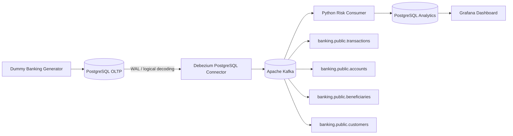

# Banking CDC — Near Real-Time Risk Monitoring

Portfolio Data Engineering sederhana untuk menunjukkan **log-based Change Data Capture (CDC)** dengan use case yang memang membutuhkan perubahan data secara incremental dan cepat.

Project ini mensimulasikan aplikasi core banking yang hanya menulis ke PostgreSQL OLTP. Perubahan row ditangkap dari PostgreSQL WAL oleh Debezium, diteruskan ke Kafka, diproses oleh lightweight Python consumer, lalu disimpan ke PostgreSQL analytics dan divisualisasikan di Grafana dengan refresh 5 detik.

> Fokus project: **memahami CDC dan engineering judgement**, bukan membuat sistem fraud detection production-grade.

---

## 1. Problem yang diselesaikan

Bayangkan aplikasi banking lama hanya menulis transaksi ke PostgreSQL. Tim operational risk ingin melihat suspicious transaction lebih cepat daripada batch setiap 30–60 menit.

Polling seperti ini bisa dilakukan:

```sql
SELECT *
FROM transactions
WHERE updated_at > :last_run;
```

Tetapi polling mempunyai trade-off:

- query berulang ke database OLTP;
- latency tergantung interval polling;
- DELETE lebih sulit ditangkap;
- harus mengelola watermark/timestamp boundary;
- perubahan `INSERT`, `UPDATE`, dan `DELETE` tidak direpresentasikan sebagai change event yang eksplisit.

Karena source system pada project ini **hanya menulis ke database dan belum menghasilkan domain events**, log-based CDC adalah pilihan yang masuk akal.

---

## 2. Architecture



Flow utama:

```text
PostgreSQL transaction
        ↓
PostgreSQL WAL
        ↓
Debezium
        ↓
Kafka change event
        ↓
Python consumer
        ↓
current state + event history + risk alerts
        ↓
Grafana (5s refresh)
```

---

## 3. Kenapa tools ini dipilih?

| Layer | Tool | Judgement |
|---|---|---|
| Source OLTP | PostgreSQL 17 | mudah mensimulasikan operational DB dan mendukung logical replication |
| CDC | Debezium 3.6 | membaca committed row changes dari PostgreSQL WAL |
| Event log | Apache Kafka 4.3.1 | durable buffer, replay, dan memisahkan source dari consumer |
| Processing | Python | workload kecil tidak membutuhkan Spark/Flink |
| Analytics store | PostgreSQL 17 | volume portfolio kecil; warehouse cloud tidak diperlukan |
| Visualization | Grafana 13.1.3 | cocok untuk operational near-real-time dashboard |
| Runtime | Docker Compose | semua komponen dapat dijalankan lokal dengan sedikit infrastructure overhead |

### Yang sengaja tidak digunakan

- **Airflow** — pipeline event-driven, bukan scheduled batch.
- **dbt** — MVP hanya membutuhkan current-state tables, CDC history, dan beberapa query dashboard.
- **Spark / PySpark** — volume dummy terlalu kecil untuk distributed processing.
- **Flink** — belum membutuhkan stateful/event-time streaming yang kompleks.
- **Kubernetes** — satu mesin portfolio tidak membutuhkan orchestration cluster.
- **BigQuery** — PostgreSQL cukup untuk data kecil dan query dashboard sederhana.
- **ML fraud detection** — fokus project adalah CDC/data engineering.

Menambahkan tools tersebut hanya untuk showcase akan membuat project lebih sulit dijelaskan tanpa menyelesaikan problem tambahan yang nyata.

---

## 4. Source tables

Hanya empat tabel source yang di-CDC:

```text
customers
accounts
beneficiaries
transactions
```

### Kenapa tabel ini?

- `transactions`: transaksi baru dan perubahan status perlu cepat diketahui.
- `accounts`: perubahan status `ACTIVE/FROZEN` menjadi signal risk.
- `beneficiaries`: beneficiary baru dapat menjadi context untuk transfer berikutnya.
- `customers`: KYC/risk profile adalah state yang dapat berubah.

Reference table statis seperti country/currency/branch sengaja tidak dibuat karena tidak dibutuhkan oleh problem MVP.

---

## 5. Risk rules

Tidak ada ML. Hanya tiga deterministic rules agar fokus tetap pada CDC.

### Rule 1 — High Value Transfer

```text
amount >= Rp50.000.000
```

Output:

```text
HIGH_VALUE_TRANSFER
```

### Rule 2 — New Beneficiary + Large Transfer

```text
beneficiary age <= 10 minutes
AND
amount >= Rp20.000.000
```

Output:

```text
NEW_BENEFICIARY_LARGE_TRANSFER
```

### Rule 3 — Frozen Account Activity

```text
account.status = FROZEN
AND
new transaction appears
```

Output:

```text
FROZEN_ACCOUNT_ACTIVITY
```

---

# MANUAL SETUP TUTORIAL

Tujuan bagian ini adalah menjalankan project **layer demi layer**, bukan menyembunyikan setup dengan Makefile.

Semua command dapat di-copy-paste.

## 6. Prerequisites

Install:

- Docker Engine / Docker Desktop
- Docker Compose v2
- Git optional
- `curl`

Recommended resource minimum untuk Docker:

```text
4 CPU
6–8 GB RAM
```

Cek instalasi:

```bash
docker --version
docker compose version
curl --version
```

> Windows PowerShell: jika `curl` bermasalah karena alias PowerShell, gunakan `curl.exe` pada command HTTP di bawah.

---

## 7. Masuk ke project

Setelah unzip:

```bash
cd banking-cdc-risk-monitoring
```

Lihat file:

```bash
find . -maxdepth 3 -type f | sort
```

Jika memakai PowerShell dan tidak memiliki `find` Linux, cukup buka folder di VS Code.

---

## 8. Validasi Docker Compose

Jalankan:

```bash
docker compose config
```

Command ini hanya memvalidasi dan menampilkan hasil Compose. Belum ada container yang dijalankan.

---

## 9. Pull image dan build Python services

Pull image infrastructure:

```bash
docker compose pull source-postgres analytics-postgres kafka connect grafana
```

Build Python consumer dan generator:

```bash
docker compose build consumer generator
```

Image utama yang digunakan:

```text
postgres:17-alpine
apache/kafka:4.3.1
quay.io/debezium/connect:3.6
grafana/grafana:13.1.3
python:3.12-slim
```

---

# PHASE A — SOURCE + KAFKA

## 10. Start source PostgreSQL, analytics PostgreSQL, dan Kafka

```bash
docker compose up -d source-postgres analytics-postgres kafka
```

Cek status:

```bash
docker compose ps
```

Anda seharusnya melihat:

```text
banking-source-postgres
banking-analytics-postgres
banking-kafka
```

---

## 11. Pahami kenapa PostgreSQL source berbeda dengan analytics

Source:

```text
localhost:5432
DB: core_banking
```

Analytics:

```text
localhost:5433
DB: banking_analytics
```

Dashboard **tidak query OLTP source langsung**. CDC mengirim perubahan ke downstream analytics DB terlebih dahulu.

Ini mensimulasikan separation antara operational workload dan downstream analytics/monitoring workload.

---

## 12. Verifikasi source database

Lihat tables:

```bash
docker compose exec source-postgres \
  psql -U postgres -d core_banking \
  -c "\\dt"
```

Expected:

```text
accounts
beneficiaries
customers
transactions
```

Cek seeded accounts:

```bash
docker compose exec source-postgres \
  psql -U postgres -d core_banking \
  -c "SELECT account_id, balance, status FROM accounts ORDER BY account_id;"
```

---

## 13. Verifikasi WAL logical replication

```bash
docker compose exec source-postgres \
  psql -U postgres -d core_banking \
  -c "SHOW wal_level;"
```

Expected:

```text
logical
```

Cek publication:

```bash
docker compose exec source-postgres \
  psql -U postgres -d core_banking \
  -c "SELECT pubname FROM pg_publication;"
```

Expected:

```text
banking_publication
```

Mengapa publication dibuat manual?

Karena connector tidak perlu diberi privilege DDL yang lebih luas hanya untuk membuat publication secara otomatis.

---

## 14. Verifikasi Kafka

List topic sebelum Debezium aktif:

```bash
docker compose exec kafka \
  /opt/kafka/bin/kafka-topics.sh \
  --bootstrap-server localhost:9092 \
  --list
```

Saat ini topic CDC source mungkin belum ada.

---

# PHASE B — DEBEZIUM CDC

## 15. Start Kafka Connect + Debezium

```bash
docker compose up -d connect
```

Cek log:

```bash
docker compose logs -f connect
```

Ketika REST API sudah aktif, tekan `Ctrl+C` untuk keluar dari log. Container tetap berjalan.

Test REST API:

```bash
curl http://localhost:8083/
```

PowerShell alternatif:

```powershell
curl.exe http://localhost:8083/
```

---

## 16. Lihat connector plugin yang tersedia

```bash
curl http://localhost:8083/connector-plugins
```

Cari:

```text
io.debezium.connector.postgresql.PostgresConnector
```

---

## 17. Register PostgreSQL Debezium connector

Linux/macOS/WSL:

```bash
curl -i -X POST \
  -H "Accept:application/json" \
  -H "Content-Type:application/json" \
  http://localhost:8083/connectors/ \
  --data @debezium/connector.json
```

PowerShell:

```powershell
curl.exe -i -X POST `
  -H "Accept:application/json" `
  -H "Content-Type:application/json" `
  http://localhost:8083/connectors/ `
  --data-binary "@debezium/connector.json"
```

Connector config penting:

```text
plugin.name = pgoutput
slot.name = banking_debezium_slot
publication.name = banking_publication
snapshot.mode = initial
topic.prefix = banking
```

`pgoutput` adalah logical decoding plugin bawaan PostgreSQL modern, jadi tidak perlu memasang plugin PostgreSQL tambahan.

---

## 18. Cek connector status

```bash
curl http://localhost:8083/connectors/banking-postgres-cdc/status
```

Cari:

```text
"state":"RUNNING"
```

Jika status `FAILED`, lihat log:

```bash
docker compose logs --tail=200 connect
```

---

## 19. Verifikasi replication slot

```bash
docker compose exec source-postgres \
  psql -U postgres -d core_banking \
  -c "SELECT slot_name, plugin, slot_type, active FROM pg_replication_slots;"
```

Expected kurang lebih:

```text
banking_debezium_slot | pgoutput | logical | t
```

Ini adalah bukti bahwa Debezium membaca PostgreSQL melalui logical replication/WAL, bukan polling SQL timestamp.

---
## 20. Lihat Kafka CDC topics hasil initial snapshot

Setelah connector Debezium berstatus `RUNNING`, cek topic Kafka:

```bash
docker compose exec kafka \
  /opt/kafka/bin/kafka-topics.sh \
  --bootstrap-server localhost:9092 \
  --list
```

Pada kondisi awal, **belum tentu semua source topic langsung ada**.

Source database project ini memiliki kondisi awal:

```text
customers      → sudah memiliki seed data
accounts       → sudah memiliki seed data
beneficiaries  → masih kosong
transactions   → masih kosong
```

Karena connector menggunakan:

```text
snapshot.mode = initial
```

Debezium menghasilkan snapshot event (`op = r`) untuk row yang sudah ada.

Karena itu, pada tahap ini minimal Anda kemungkinan melihat:

```text
banking.public.accounts
banking.public.customers
```

Selain Kafka internal topics seperti:

```text
__consumer_offsets
__debezium-heartbeat.banking
banking_connect_configs
banking_connect_offsets
banking_connect_statuses
```

Topic berikut **mungkin belum ada**:

```text
banking.public.beneficiaries
banking.public.transactions
```

Ini bukan error.

Kafka topic tersebut baru digunakan ketika Debezium mempunyai record untuk dipublish dari tabel terkait.

---

## 21. Inspect initial snapshot event

Cek satu snapshot event dari account:

```bash
docker compose exec kafka \
  /opt/kafka/bin/kafka-console-consumer.sh \
  --bootstrap-server localhost:9092 \
  --topic banking.public.accounts \
  --from-beginning \
  --max-messages 1
```

Cari struktur seperti:

```json
{
  "before": null,
  "after": {
    "account_id": "...",
    "status": "ACTIVE"
  },
  "source": {
    "db": "core_banking",
    "schema": "public",
    "table": "accounts"
  },
  "op": "r"
}
```

Arti operasi Debezium:

```text
r = snapshot read
c = create / INSERT
u = update
d = delete
```

Perhatikan bahwa:

```text
op = r
```

berasal dari **initial snapshot**, bukan transaksi baru setelah connector berjalan.

---

# PHASE C — MATERIALIZE & VERIFY CDC TOPICS

Sebelum Python consumer dijalankan, kita akan membuat perubahan pertama pada tabel yang masih kosong.

Tujuannya:

```text
beneficiaries kosong
      ↓
buat INSERT
      ↓
Debezium menghasilkan event
      ↓
banking.public.beneficiaries tersedia


transactions kosong
      ↓
buat INSERT / UPDATE
      ↓
Debezium menghasilkan event
      ↓
banking.public.transactions tersedia
```

Ini juga membantu memahami bahwa consumer tidak harus hidup pada saat event dibuat.

Kafka akan menyimpan event sampai consumer membacanya.

---

## 22. Generate bootstrap CDC events

Jalankan suspicious scenario satu kali:

```bash
docker compose --profile demo run --rm generator suspicious
```

Scenario ini dipilih karena menyentuh kedua tabel yang sebelumnya kosong:

```text
1. INSERT beneficiary baru
2. tunggu sekitar 2 detik
3. INSERT transaction status=PENDING
4. UPDATE transaction PENDING → SUCCESS
5. update balance account terkait
```

Alur yang terjadi:

```text
Generator
   ↓
PostgreSQL
   ↓
WAL
   ↓
Debezium
   ↓
Kafka Connect
   ↓
Kafka
```

Perhatikan:

```text
Python risk consumer BELUM dijalankan.
```

Ini disengaja.

Kafka tetap menyimpan CDC event meskipun downstream consumer belum aktif.

---

## 23. Verifikasi semua CDC topics sekarang tersedia

Cek ulang:

```bash
docker compose exec kafka \
  /opt/kafka/bin/kafka-topics.sh \
  --bootstrap-server localhost:9092 \
  --list
```

Sekarang expected source topics:

```text
banking.public.accounts
banking.public.beneficiaries
banking.public.customers
banking.public.transactions
```

Mental model:

```text
customers
existing rows
   ↓ snapshot
topic created


accounts
existing rows
   ↓ snapshot
topic created


beneficiaries
first INSERT
   ↓ WAL
   ↓ Debezium
topic created


transactions
first INSERT / UPDATE
   ↓ WAL
   ↓ Debezium
topic created
```

Jika keempat topic sudah ada, baru lanjut ke consumer.

---

## 24. Inspect beneficiary CDC event

Cek event beneficiary:

```bash
docker compose exec kafka \
  /opt/kafka/bin/kafka-console-consumer.sh \
  --bootstrap-server localhost:9092 \
  --topic banking.public.beneficiaries \
  --from-beginning \
  --max-messages 1
```

Expected operation:

```text
op = c
```

Kenapa bukan `r`?

Karena beneficiary dibuat **setelah initial snapshot selesai**.

Jadi:

```text
existing row saat snapshot
→ op = r

INSERT setelah snapshot
→ op = c
```

---

## 25. Inspect transaction lifecycle

Cek transaction events:

```bash
docker compose exec kafka \
  /opt/kafka/bin/kafka-console-consumer.sh \
  --bootstrap-server localhost:9092 \
  --topic banking.public.transactions \
  --from-beginning \
  --max-messages 2
```

Anda seharusnya menemukan lifecycle seperti:

```text
EVENT 1

op = c
before = null
after.status = PENDING
```

kemudian:

```text
EVENT 2

op = u
before.status = PENDING
after.status = SUCCESS
```

Ini merupakan bukti utama bahwa project menangkap **database change lifecycle**, bukan hanya mengirim transaction baru ke Kafka melalui producer aplikasi.

---

## 26. Optional — Inspect dengan Kafka UI

Start Kafka UI:

```bash
docker compose up -d kafka-ui
```

Buka:

```text
http://100.120.10.52:8080
```

Masuk ke:

```text
banking-local
→ Topics
```

Pastikan ada:

```text
banking.public.accounts
banking.public.beneficiaries
banking.public.customers
banking.public.transactions
```

Untuk melihat transaction CDC:

```text
Topics
→ banking.public.transactions
→ Messages
```

Perhatikan:

```text
topic
partition
offset
timestamp
key
payload
before
after
op
```

Kafka UI hanya digunakan untuk observability/debugging.

Ia bukan bagian dari business data flow.

---

# PHASE D — CDC CONSUMER

Sekarang upstream CDC stream sudah lengkap.

Baru jalankan downstream consumer.

---

## 27. Start Python consumer

```bash
docker compose up -d consumer
```

Lihat log:

```bash
docker compose logs -f consumer
```

Consumer subscribe ke:

```text
banking.public.customers
banking.public.accounts
banking.public.beneficiaries
banking.public.transactions
```

Alurnya:

```text
Kafka topics
     ↓
Python consumer subscribe
     ↓
poll records
     ↓
process event
     ↓
write analytics PostgreSQL
     ↓
commit Kafka offset
```

Karena bootstrap event sudah berada di Kafka sebelum consumer hidup, consumer akan memproses backlog sesuai konfigurasi offset consumer group.

Untuk project ini, consumer pertama kali harus dapat membaca existing records, bukan hanya message baru.

Jika consumer menggunakan Kafka configuration langsung, pastikan konfigurasi initial offset menggunakan:

```text
auto.offset.reset = earliest
```

ketika consumer group belum mempunyai committed offset.

---

## 28. Verifikasi consumer tidak error

Lihat:

```bash
docker compose logs --tail=100 consumer
```

Jangan ada lagi error:

```text
UNKNOWN_TOPIC_OR_PART
```

atau:

```text
Analytics PostgreSQL not ready
```

Jika consumer berjalan normal:

```bash
docker compose ps consumer
```

Expected:

```text
banking-risk-consumer   Up
```

---

## 29. Verifikasi reconstructed current state

Cek downstream:

```bash
docker compose exec analytics-postgres \
  psql -U analytics_app -d banking_analytics \
  -c "
SELECT COUNT(*) AS customers FROM customers_current;
SELECT COUNT(*) AS accounts FROM accounts_current;
SELECT COUNT(*) AS beneficiaries FROM beneficiaries_current;
SELECT COUNT(*) AS transactions FROM transactions_current;
"
```

Expected secara konseptual:

```text
customers      > 0
accounts       > 0
beneficiaries  > 0
transactions   > 0
```

`customers_current` dan `accounts_current` terutama berasal dari initial snapshot.

Sedangkan beneficiary dan transaction pertama berasal dari bootstrap CDC events yang dibuat sebelumnya.

---

## 30. Verifikasi CDC event history

```bash
docker compose exec analytics-postgres \
  psql -U analytics_app -d banking_analytics \
  -c "
SELECT
    table_name,
    operation,
    COUNT(*)
FROM cdc_events
GROUP BY 1,2
ORDER BY 1,2;
"
```

Sekarang Anda seharusnya melihat kombinasi operation seperti:

```text
accounts       | r
accounts       | u
beneficiaries  | c
customers      | r
transactions   | c
transactions   | u
```

Tidak harus persis sama jumlahnya, tetapi sekarang Anda dapat membedakan:

```text
r → snapshot
c → INSERT baru
u → UPDATE
```

---

# PHASE E — GRAFANA

## 31. Start Grafana

```bash
docker compose up -d grafana
```

Buka dari device yang terhubung ke Tailscale:

```text
http://100.120.10.52:3000
```

Login:

```text
username: admin
password: admin
```

Dashboard:

```text
Banking CDC
→ Banking CDC — Near Real-Time Risk Monitoring
```

Grafana membaca:

```text
analytics-postgres:5432
```

melalui Docker network.

Grafana tidak membaca source OLTP langsung.

Flow:

```text
PostgreSQL OLTP
      ↓ CDC
Kafka
      ↓
Consumer
      ↓
PostgreSQL Analytics
      ↓
Grafana
```

Dashboard refresh setiap sekitar:

```text
5 seconds
```

Karena Grafana masih melakukan periodic query terhadap analytics PostgreSQL, istilah yang digunakan adalah:

```text
near real-time dashboard
```

bukan streaming UI real-time.

---

# PHASE F — DEMO

Infrastructure, CDC stream, consumer, dan dashboard sekarang sudah siap.

Demo berikut digunakan untuk menghasilkan perubahan baru setelah seluruh pipeline aktif.

---

## 32. Demo 1 — Normal transaction

Jalankan:

```bash
docker compose --profile demo run --rm generator normal
```

Yang terjadi:

```text
1. INSERT transaction status=PENDING
2. PostgreSQL menulis committed change ke WAL
3. Debezium menangkap INSERT
4. Kafka menerima op=c
5. Consumer membaca transaction event
6. consumer update transactions_current
7. source transaction berubah PENDING → SUCCESS
8. Debezium menangkap UPDATE
9. Kafka menerima op=u
10. consumer update current state
11. Grafana menampilkan state terbaru
```

Normal transaction seharusnya tidak menghasilkan risk alert.

Cek source:

```bash
docker compose exec source-postgres \
  psql -U postgres -d core_banking \
  -c "
SELECT
    transaction_id,
    amount,
    channel,
    status,
    created_at
FROM transactions
ORDER BY created_at DESC
LIMIT 5;
"
```

Cek downstream:

```bash
docker compose exec analytics-postgres \
  psql -U analytics_app -d banking_analytics \
  -c "
SELECT
    transaction_id,
    amount,
    channel,
    status,
    created_at
FROM transactions_current
ORDER BY created_at DESC
LIMIT 5;
"
```

---

## 33. Demo 2 — Suspicious transaction

Jalankan:

```bash
docker compose --profile demo run --rm generator suspicious
```

Scenario:

```text
1. customer menambahkan beneficiary baru
2. tunggu sekitar 2 detik
3. customer transfer Rp75.000.000
4. transaction berubah PENDING → SUCCESS
```

Expected risk rules:

```text
HIGH_VALUE_TRANSFER
NEW_BENEFICIARY_LARGE_TRANSFER
```

Cek consumer:

```bash
docker compose logs --tail=100 consumer
```

Cari:

```text
RISK ALERT
```

Cek database:

```bash
docker compose exec analytics-postgres \
  psql -U analytics_app -d banking_analytics \
  -c "
SELECT
    alert_created_at,
    transaction_id,
    amount,
    rule_code,
    severity
FROM risk_alerts
ORDER BY alert_created_at DESC;
"
```

Grafana seharusnya menampilkan perubahan seperti:

```text
Risk Alerts      +2
Flagged Amount   +Rp75M
```

---

## 34. Demo 3 — Frozen account activity

```bash
docker compose --profile demo run --rm generator frozen
```

Scenario:

```text
account ACTIVE
      ↓
FROZEN
      ↓
transaction attempted
      ↓
transaction FAILED
      ↓
account ACTIVE kembali
```

Expected alert:

```text
FROZEN_ACCOUNT_ACTIVITY
```

Scenario ini menunjukkan bahwa CDC tidak hanya menangkap:

```text
INSERT transactions
```

tetapi juga perubahan state:

```text
UPDATE accounts
```

yang kemudian digunakan oleh downstream risk logic.

---

## 35. Continuous dummy stream

Untuk melihat dashboard bergerak:

```bash
docker compose --profile demo run --rm generator stream --interval 2
```

Stop:

```text
Ctrl+C
```

Untuk menyisipkan suspicious scenario setiap 10 transaksi:

```bash
docker compose --profile demo run --rm generator stream \
  --interval 2 \
  --risk-every 10
```

Gunakan mode ini untuk screen recording Grafana.

---

# Urutan setup final

Mental model setup manual project sekarang adalah:

```text
PHASE A
Source PostgreSQL
Analytics PostgreSQL
Kafka
        ↓
verify source + WAL + broker


PHASE B
Kafka Connect
Debezium connector
        ↓
verify RUNNING
verify replication slot
        ↓
initial snapshot


PHASE C
Generate first source changes
        ↓
materialize empty-table topics
        ↓
verify 4 CDC topics
        ↓
inspect raw events


PHASE D
Start consumer
        ↓
subscribe
        ↓
poll backlog
        ↓
reconstruct downstream state


PHASE E
Start Grafana
        ↓
verify dashboard


PHASE F
Run normal / suspicious / frozen demos
```

Atau secara end-to-end:

```text
SETUP SOURCE
     ↓
CHECK WAL
     ↓
START KAFKA
     ↓
START KAFKA CONNECT
     ↓
REGISTER DEBEZIUM
     ↓
CHECK CONNECTOR
     ↓
GENERATE FIRST CHANGE
     ↓
CHECK TOPICS
     ↓
CHECK RAW EVENT
     ↓
START CONSUMER
     ↓
CHECK DOWNSTREAM
     ↓
START DASHBOARD
     ↓
RUN DEMOS
```

---

# Tambahan Troubleshooting — Topic belum tersedia

Jika consumer mendapatkan:

```text
UNKNOWN_TOPIC_OR_PART
```

misalnya:

```text
Subscribed topic not available:
banking.public.beneficiaries
```

cek topic:

```bash
docker compose exec kafka \
  /opt/kafka/bin/kafka-topics.sh \
  --bootstrap-server localhost:9092 \
  --list
```

Jika topic untuk tabel kosong belum tersedia, jangan langsung menyimpulkan Debezium gagal.

Cek:

```bash
docker compose exec source-postgres \
  psql -U postgres -d core_banking \
  -c "
SELECT COUNT(*) FROM beneficiaries;
SELECT COUNT(*) FROM transactions;
"
```

Jika masih:

```text
0 rows
```

jalankan first CDC scenario:

```bash
docker compose --profile demo run --rm generator suspicious
```

kemudian cek topic lagi.

Target:

```text
banking.public.accounts
banking.public.beneficiaries
banking.public.customers
banking.public.transactions
```

Setelah itu baru start/restart consumer.

---

# Revisi Definition of Done

Project dianggap selesai jika:

* [ ] PostgreSQL menjalankan `wal_level=logical`.
* [ ] Publication berisi empat source table.
* [ ] Debezium replication slot aktif.
* [ ] Debezium connector berstatus `RUNNING`.
* [ ] Initial snapshot menghasilkan event `op=r`.
* [ ] First source changes menghasilkan topic untuk tabel yang awalnya kosong.
* [ ] Kafka memiliki empat source CDC topics setelah bootstrap event.
* [ ] Transaction menghasilkan `op=c` dan `op=u`.
* [ ] Consumer dapat membaca event yang sudah tersimpan sebelum consumer aktif.
* [ ] Consumer membentuk current-state tables di analytics PostgreSQL.
* [ ] Suspicious transaction menghasilkan expected risk alerts.
* [ ] Frozen account scenario menghasilkan `FROZEN_ACCOUNT_ACTIVITY`.
* [ ] Kafka replay tidak menggandakan `cdc_events`.
* [ ] Risk rule yang sama tidak duplicate untuk transaction yang sama.
* [ ] Grafana menampilkan perubahan dengan refresh sekitar 5 detik.
* [ ] Anda dapat menjelaskan alur `source → WAL → Debezium → Kafka Connect → Kafka → consumer → downstream`.
